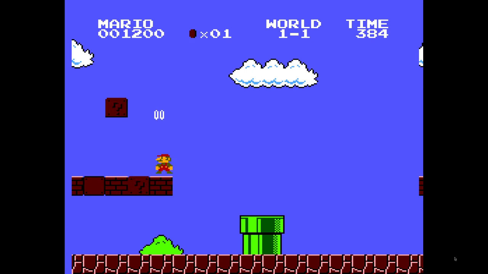
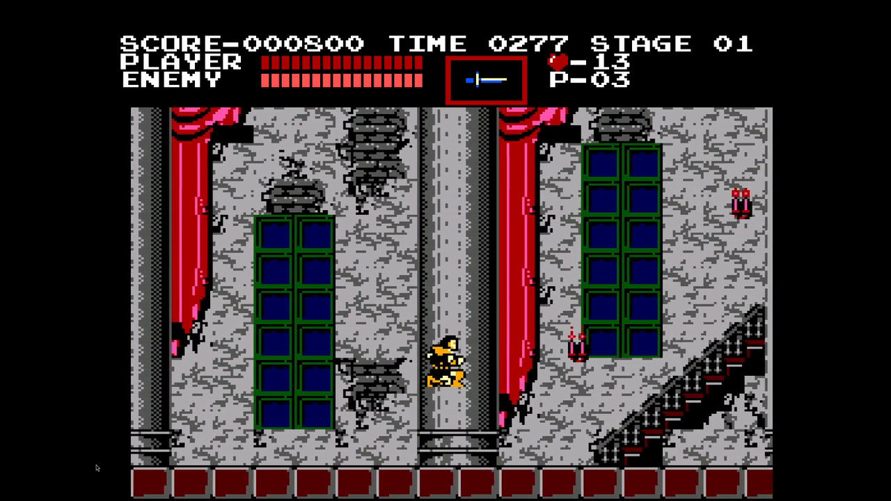

# nes-to-sms

A Rust pipeline that translates NES ROMs into Sega Master System projects,
with mapper 0 (NROM), mapper 2 (UxROM), and experimental mapper 4 (MMC3)
support. The output is a buildable
WLA-DX project: extracted
assets, an annotated 6502 disassembly, lifted IR, lowered Z80 with
SMS-native runtime calls, and a `Makefile` that produces a `.sms` ROM.

The canonical plan lives in [`docs/master-plan.md`](docs/master-plan.md).
This README is the operational on-ramp.

## Gameplay recordings

Actual emulator captures from September 7, 2026. Click a preview to watch or
download the full recording, with audio (720p, 30 fps). These demonstrate the
current translations, not stock-clock Master System performance; emulator
overclock settings affect gameplay speed, and visual/audio limitations remain.

| Super Mario Bros. — NROM | Castlevania — UxROM |
|---|---|
| [](docs/media/smb-gameplay.mp4?raw=true) | [](docs/media/castlevania-gameplay.mp4?raw=true) |
| [Watch SMB: World 1-1 into 1-2](docs/media/smb-gameplay.mp4?raw=true) · 1:31 · 5.5 MB | [Watch Castlevania: title and Stage 1](docs/media/castlevania-gameplay.mp4?raw=true) · 2:52 · 16.4 MB |

The MP4s are stored in Git LFS; previews are ordinary Git files. To fetch
the recordings locally, run `git lfs install --local` and `git lfs pull`.
See [media encoding notes](docs/media/README.md) for sizes and settings.

## Current status

- **Super Mario Bros.:** boots and plays, with automated World 1-1 clear,
  bonus-pipe, death/game-over and World 1-2 transition checks. The moving-HUD
  fix is verified in consecutive video frames at 300/500 emulator overclock:
  [results](docs/smb-hud-motion.md).
- **Castlevania:** mapper-2 banking and CHR-RAM translation support title,
  outdoor and indoor Stage 1 gameplay, pickups, weapons and stairs. Speed and
  rendering fidelity still need work; this is not full-game completion.
- **Super Mario Bros. 3:** experimental MMC3 conversion completes an input-only
  1-1 route: movement, jumping, mushroom pickup, level clear and return to the
  map. It is still very slow (about 3.8 game updates/second during that traversal
  at 500% overclock) and blanks during rebuilds. This is functional first-level
  support, not full-speed/full-game support or cycle-accurate IRQ emulation.
  [Plan and limits](docs/smb3-plan.md).
- **Validation:** 13 Rust crates; the latest workspace run has 577 passing
  tests, plus separately run assembled-runtime and actual-emulator checks.
  NES APU audio is approximated on the SMS PSG, not reproduced exactly.

See the [ordered work queue](docs/completion-plan.md),
[visual limitations](docs/visual-parity.md), and
[CV1 performance research](docs/cv1-double-performance-research.md).

## Workspace layout

```
Cargo.toml                workspace root
crates/
  nes_rom/                iNES / NES 2.0 header parsing
  cpu6502/                2A03 instruction decoder (256 opcodes, all modes)
  profile/                TOML profile schema + loader
  ir/                     semantic IR with explicit flags + memory tags
  oracle_6502/            2A03 interpreter for differential testing
  z80_emit/               Z80 instruction encoder + asm text emitter
  z80_emu/                Z80 interpreter for differential testing
  assets/                 CHR → SMS 4bpp, NES palette → SMS CRAM, PPM preview
  analysis/               function discovery, CFG, code/data classification
  lower/                  IR → Z80 lowering with shadow flags + runtime calls
  sms_project/            WLA-DX project emitter (Makefile, link.cfg, sms.asm)
  validation/             randomized 6502 ↔ Z80 differential tests
  cli/                    `nes-to-sms` binary (pipeline orchestrator)
runtime/                  hand-written Z80 SMS runtime
profiles/                 game profiles and acceptance routes (SMB, CV1, others)
docker/                   Dockerfile.toolchain (Rust + WLA-DX + Mednafen)
docs/                     plans, status, research notes
```

## Usage

### Native run

```sh
cargo run --release -p nes_to_sms --bin nes-to-sms -- \
    "/path/to/rom.nes" \
    profiles/smb.toml \
    out/smb \
    --runtime runtime
```

This produces `out/smb/` with:

```
out/smb/
  Makefile                WLA-DX build driver
  link.cfg                link script enumerating .o files
  sms.asm                 top-level project: memory map, ROM map, includes
  runtime/                copied from --runtime arg
  generated/translated.asm   the lowered Z80 from your ROM
  data/chr.4bpp           NES CHR converted to SMS 4bpp tiles
  data/palette.cram       32-byte SMS CRAM
  data/nametable.bin      placeholder name-table (zeros)
  reports/discovery.txt   what analysis found and didn't
  reports/lifted.txt      per-routine IR summary
  reports/lower_failures.txt   routines that couldn't be lowered (if any)
```

### Build to `.sms`

The `out/smb/` tree is a WLA-DX project. To assemble (requires WLA-DX
1.0+ on PATH or via the project Docker image):

```sh
cd out/smb && make
```

The dockerized build avoids host installs:

```sh
DOCKER_UID=$(id -u) DOCKER_GID=$(id -g) docker compose run --rm --workdir /work poc \
    bash -c 'cargo run --release -p nes_to_sms --bin nes-to-sms -- /roms/nes/...nes profiles/smb.toml out/smb --runtime runtime && make -C out/smb'
```

## How the pipeline works

```
.nes + profile.toml
        │
        ▼
   nes_rom::parse           ── header, PRG, CHR, vectors
        │
        ▼
   profile::load            ── extra roots, labels, data regions,
        │                      replacement annotations
        ▼
   analysis::analyze        ── function discovery (vector + JSR walk +
        │                      profile roots), CFG, code/data classifier
        ▼
   ir::lift_range × N       ── per-function: 6502 → IR with explicit flags
        │                      and tagged memory accesses
        ▼
   lower::lower_routine     ── IR → Z80 (shadow flags in RAM, hardware
        │                      accesses route to runtime calls)
        ▼
   z80_emit::Program         ── byte buffer + WLA-DX assembly listing
        │
        ▼
   assets::nes_chr_to_sms_4bpp + palette mapping
        │
        ▼
   sms_project::emit_project ── writes Makefile + link.cfg + sms.asm
                                + runtime/ + generated/ + data/ + reports/
```

The Z80 output is conservative and explicit:

- 6502 `A` ↔ Z80 `A`.
- 6502 `X`/`Y` use resident Z80 `D`/`E`, synchronized with runtime RAM shadows.
- 6502 status byte lives at `$CB03` (shadow P).
- NES `$0000-$07FF` mirrors to SMS RAM `$C000-$C7FF`.
- Flag liveness eliminates unnecessary flag work; remaining updates use
  inline sequences or runtime helpers that maintain shadow P.
- Hardware accesses (PPU, OAM-DMA, APU, controller, mapper) become calls
  to `rt_ppu_write`, `rt_oam_dma`, etc.

See `docs/master-plan.md` "Architecture" section for full details.

## Differential testing

The `validation` crate compares lifted/lowered routines against `oracle_6502`
using `z80_emu`. Hardware and indirect-dispatch paths require full-runtime
checks. `frame-diff` compares game-state RAM against the original NES program;
actual-emulator routes check video timing and gameplay.

```sh
cargo test --workspace
cargo test -p validation --test single_ops
cargo test -p validation --test known_slices
cargo test -p nes_to_sms --test synthetic_pipeline
```

## Known limitations

- **Performance.** Playable emulator recordings are not evidence of full
  speed on stock SMS hardware. CV1 remains below NES speed even with overclock;
  the [2× performance target](docs/cv1-double-performance-research.md) is open.
- **Graphics and audio.** PPU-to-VDP conversion and APU-to-PSG audio are
  approximations. Sprite priority, some tiles and other cosmetic differences
  remain; see [visual parity](docs/visual-parity.md).
- **Compatibility.** This is not a universal NES emulator. Games need profiles
  and supported mapper/memory semantics. Unknown targets and unsupported
  operations fail closed rather than silently generating incorrect code.
- **Coverage.** Acceptance routes cover specific scenes and transitions, not
  every level or all possible inputs. Hardware routines need actual-runtime
  validation in addition to instruction-level differential tests.

## Repo policies

See [`AGENTS.md`](AGENTS.md). Highlights:

- No commercial ROM files committed.
- All non-Rust retro tooling lives in `docker/`.
- The engine stays SMB-agnostic; SMB knowledge lives in `profiles/smb.toml`
  and the Z80 runtime, never in Rust source.
- Progress is measured by pipeline coverage, not by lifted micro-slices.

## License

MIT OR Apache-2.0 for project code. Profile data and runtime asm are MIT.
ROM files and asset extracts are subject to their original copyright and
are not redistributed.
